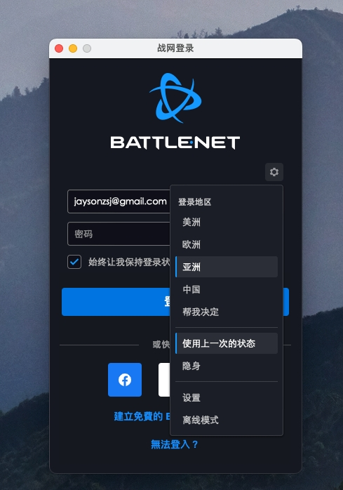
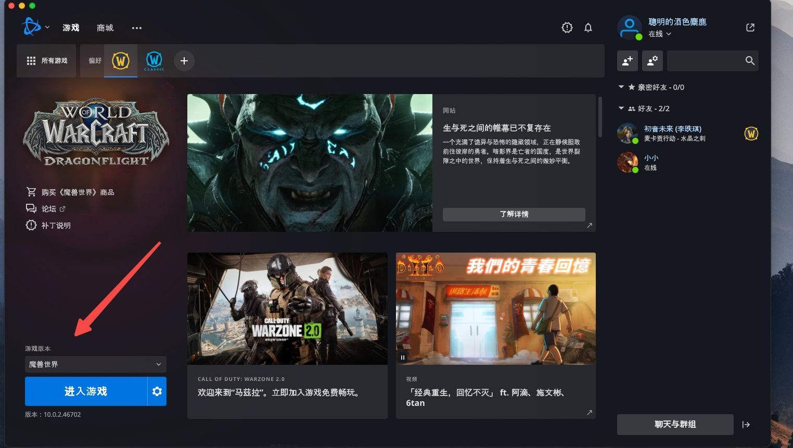
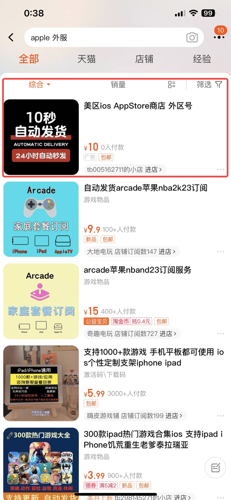
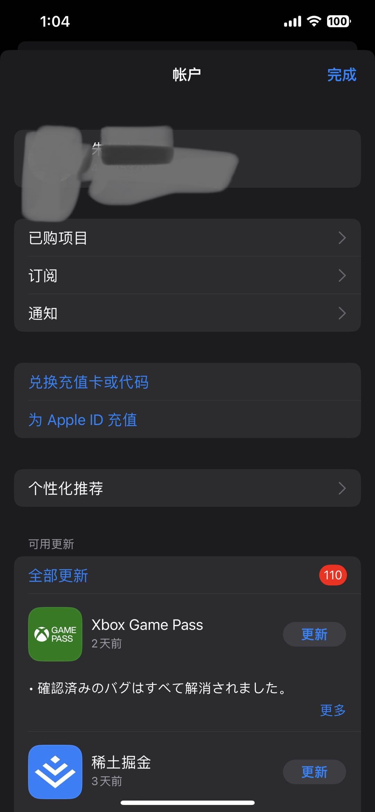
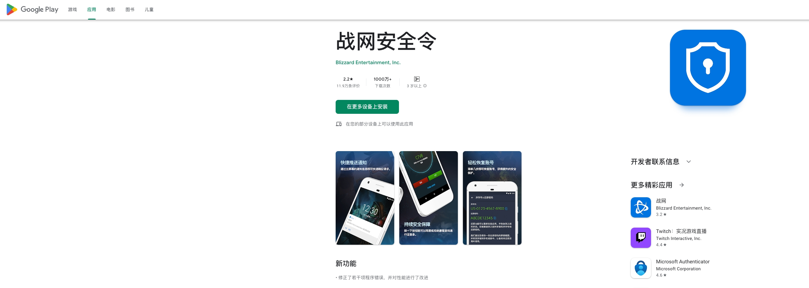
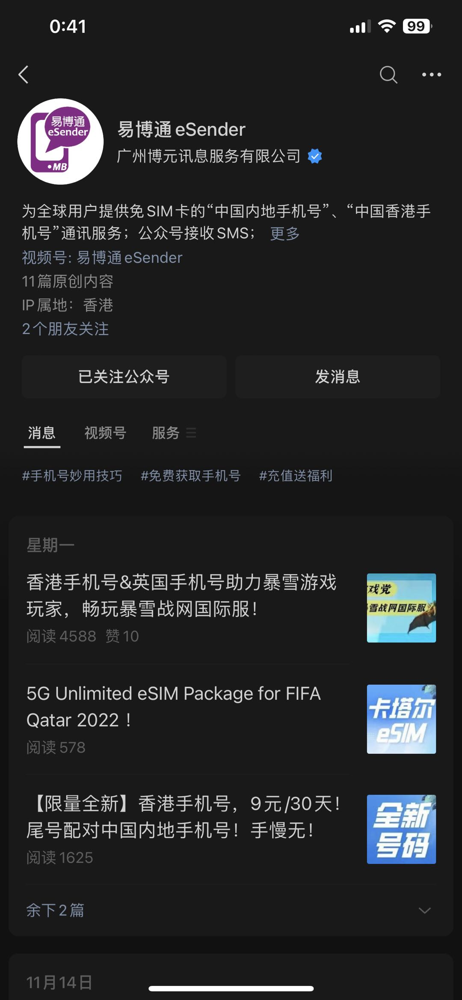

# WoW 亞服 安全認證指南 

## 準備條件
* 中國護照
* 科學上網環境(trojan|trojan-go|v2ray|vpn|ss 任意虛擬組網協議)
* 有網費有流量 有Money
* 未綁定任意戰網的郵箱地址和郵箱密碼

## 下載台服客戶端

* 任意戰網客戶端
 

* 提供郵箱註冊，並且確認登錄入口處,區別如下
 

## 安全令及手機綁定(可選)

* PS!: 如果沒有安全令，只是會缺少4個格子，以及登錄時需要填寫註冊的郵箱發送的臨時驗證碼。所以此步驟不是必須的
 
 
* (手機蘋果參考) 淘寶購買 外服AppleStroe 註冊好的賬號(推薦 個人註冊需要填寫住址不對有可能會被封號,推薦支持購買)。
 

 
更換蘋果手機內部 appstore 賬號
 

* (手機安卓參考) 在google 商店下載外服戰網安全令，安卓請確認手機有 “google service” 和 “google shop” 兩個程序，並且有自己的 “谷歌賬號”
 
https://play.google.com/store/apps/details?id=com.blizzard.bma
 

* 微信小程序購買 香港虛擬號服務，可以在微信中,直接收取香港+852的短信
 

* 使用中國護照，在 ‘易博通’ 給 +852 的手機虛擬號 進行認證，既可以接受 亞服的 手機綁定 和 戰網安全令

